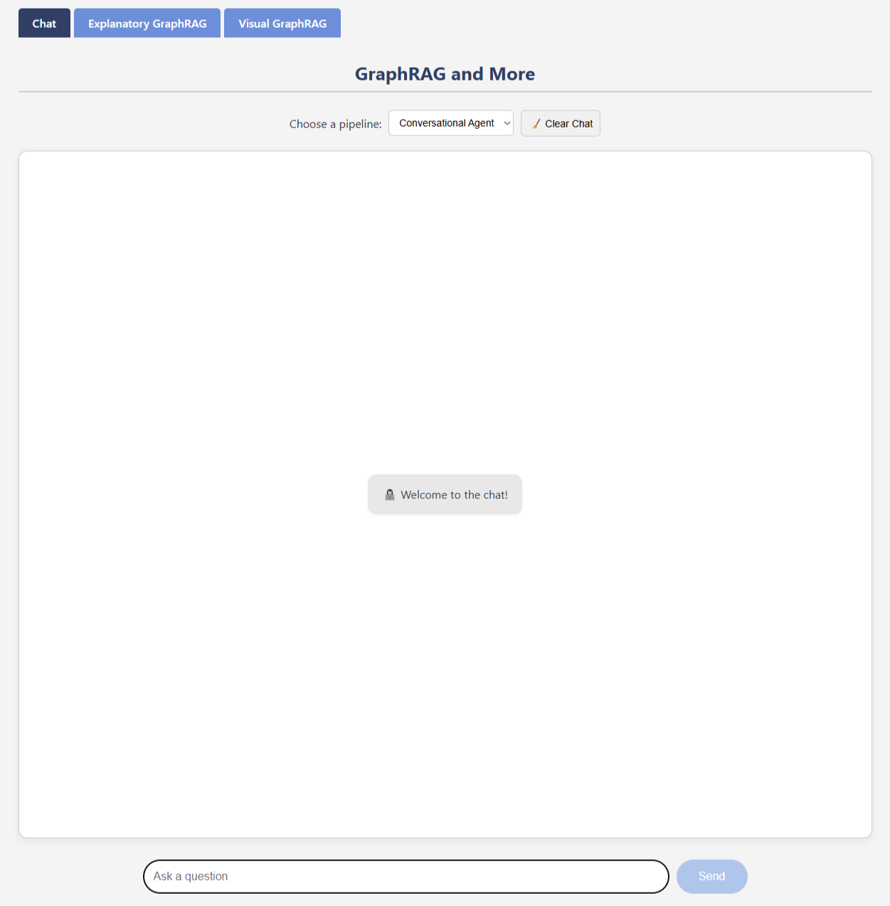

# Hybrid-Multi-Agent-GraphRAG-for-E-Government

This repository has been established in conjunction with the publication of the research paper titled **Hybrid Multi-Agent GraphRAG for E-Government: Toward a Trustworthy AI Assistant** and serves as a supplementary resource for researchers interested in creating GraphRAG in Multi-Agent systems. Our example use case is dedicated to E-Government Services.

### Citation
```bibtex
```

## Introduction

The repository contains a [FastAPI](https://github.com/fastapi/fastapi) application designed to run in Google Colab. It is built using the robust open-source [Haystack](https://github.com/deepset-ai/haystack) framework, which provides an end-to-end solution for Large Language Models (LLMs).

The application offers a web-based interface for interacting with Generative AI models such as GPT-4.1 and GPT-4.1-mini, allowing for modular selection of models. It supports a modular and extensible Multi-Agent, Graph Retrieval-Augmented Generation (GraphRAG) framework designed to enhance policy-focused question answering. Users can index their data in their Neo4J database and engage in interactive conversations with the Gen AI models of their choice. Moreover, they can assess the faithfulness of their pipelines using the custom-made LLM-based evaluators.


## Example Use Case

The use case presented in our research focuses on enhancing E-Government Services through a state-of-the-art, modular, and reproducible Multi-Agent architecture utilizing, Graphs, Embeddings, Web Search and LLMs.

In our example, we use publicly available sources, such as the [Press Corner](https://ec.europa.eu/commission/presscorner) and Web Search. The Press Corner data used complies with the terms of use policy, and all appropriate credit goes to the Press Corner. Please note that this repository is not affiliated with, sponsored by, or endorsed by the Press Corner.

Our approach emphasizes modularity and reproducibility, with all pipelines, custom GraphRAG components, and setups designed to be flexible and customizable. Users can apply different AI models, utilize their databases, integrate web search tools, implement various preprocessing steps, deploy agents, and define their data sources.


## Access Instructions

To access the notebook in Google Colab, click the badge below and follow the guidelines:

[](https://colab.research.google.com/github/gpapageorgiouedu/Hybrid-Multi-Agent-GraphRAG-for-E-Government/blob/main/GraphRAG_demo.ipynb)

Example indexing and querying pipelines, along with LLM-based faithfulness evaluation, are set up as demonstrated in our research. For usage, you will need to create your own index. All components are modular and scalable, allowing graph setups, embeddings index, generative AI models, custom retrievals, prompts, evaluators, and other elements to be modified as per users' preferences.


## Features

- **Dynamic Conversation Interface**: Provides a web-based chat interface for interacting with Gen AI models in real-time.
- **Graphs Creation**: Enables Triples generation through raw text content through custom components, utilizing LLMs.
- **Multiple Processing Modes**: Allows selection of different processing modes and models to customize how questions are handled and answered.
- **File Graph and Embeddings Indexing**: Supports both Graph and Embeddings indexing for efficient retrieval.
- **Predefined pipelines**: Specialized pipelines for handling specific types of queries and data related to E-Government Services.
- **Web Search Integration**: Leverages web search to find relevant information and generate comprehensive answers.
- **Multi-Agent Mode**: Enables dynamic conversations incorporating thought process, with the Gen AI models and multiple tools, retaining context and history.
- **Faithfulness evaluation**: LLM-based faithfulness evaluation assesses whether each statement in a generated answer is directly supported by the provided context documents, indicating the degree of factual grounding.
- **Graphs triples preview**: Enables indexed triples preview based on fuzzy search.
- **Graphs presentation**: Enables indexed triples visualization.

## Web UI example



## Repository Contents

This repository contains the following structure:

- **`RAG_Multi_Agent_demo.ipynb`**: The Jupyter Notebook usable from Google Colab that contains the main code and demonstrations for using the application with documentation.

- **`templates/`**: This directory contains HTML templates used by the FastAPI application to render web pages.

- **`static/`**: This folder includes static files such as CSS, JavaScript, and images that are used in the web interface.

- **`images/`**: This directory contains the image used in the README.


## Compliance with AI EU Act

This project is designed with compliance in mind regarding the [European Union's AI Act](https://digital-strategy.ec.europa.eu/en/policies/regulatory-framework-ai), [European Union's AI Act](https://eur-lex.europa.eu/legal-content/EN/TXT/?uri=CELEX:32024R1689), both for current use and for future updates as the regulatory landscape evolves. Users who deploy, modify, or extend this application should be aware of the AI EU Act's guidelines and ensure compliance with applicable regulations.

